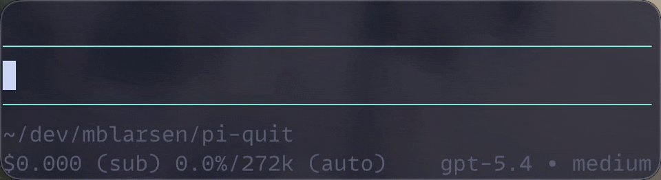

# pi-quit

A tiny [pi](https://github.com/badlogic/pi-mono/tree/main/packages/coding-agent) extension that changes the idle quit UX:



- first press of the `app.clear` keybinding shows a temporary hint
- second press within 500ms quits pi

## Behavior

When pi is idle and the editor is already empty, the first press shows a temporary footer hint:

> Ctrl+C again to quit

If you remap `app.clear` in `~/.pi/agent/keybindings.json`, this extension follows the remapped key automatically.

When the editor contains text, the clear key still clears the editor first, and a second quick press still quits.

## Install locally while developing

From this repo:

```bash
pi -e ./src/index.ts
```

Or symlink/copy the repo into one of pi's auto-discovery locations and reload:

- `~/.pi/agent/extensions/`
- `.pi/extensions/`

Because `package.json` contains a `pi.extensions` entry, you can also point pi at the repo directory.

## Install from npm (recommended)

Use the published npm package and pin a version:

```json
{
  "packages": [
    "npm:pi-quit@0.1.5"
  ]
}
```

Or via CLI:

```bash
pi install npm:pi-quit@0.1.5
```


## Notes

This uses a custom editor component instead of `registerShortcut()`.

That is necessary because pi intentionally blocks extensions from overriding reserved built-in shortcuts like `app.clear` / `Ctrl+C`. By wrapping the editor and matching the configured `app.clear` action, the extension respects user key remaps.
